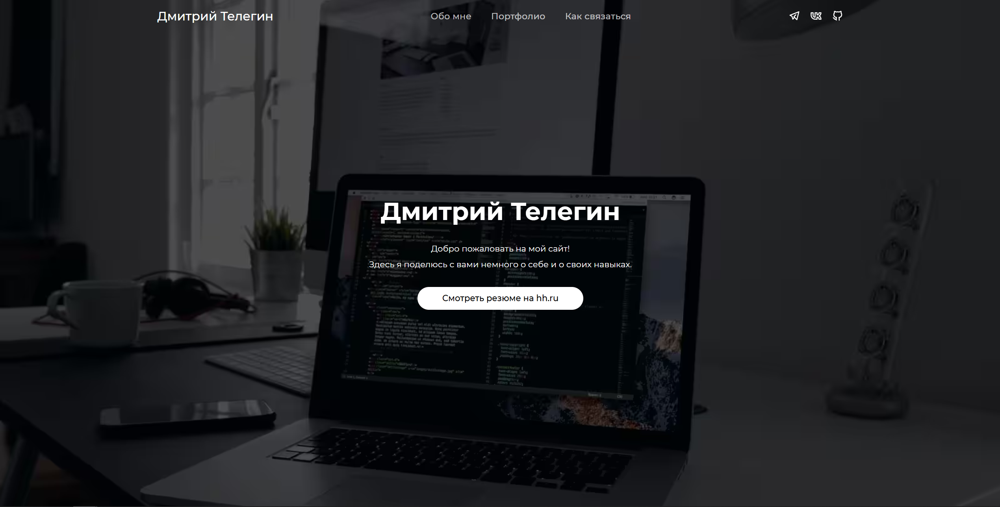

## Описание проекта

Это персональный сайт‑резюме, отражающий мои ключевые навыки, опыт и увлечения. Он адаптирован для любых устройств, имеет интуитивную навигацию и демонстрирует мои сильные стороны через лаконичный дизайн и понятную структуру.

## Обо мне

Я — разносторонний специалист с любовью к чтению, прогулкам на свежем воздухе, спорту и ораторскому искусству. Уже более трёх лет я разрабатываю веб‑приложения, но последние годы всё больше увлёкся бизнес‑логикой и сложными алгоритмами. Мне важно выстраивать крепкие отношения — как в команде, так и с клиентами — и я умею ясно и убедительно доносить идеи. Живу по системе: планирую дни и недели и всегда знаю, что нужно сделать. Создаю мощный «мозговой центр» из лучших специалистов своего окружения и регулярно провожу мозговые штурмы для анализа ошибок и планирования дальнейших шагов.

## Особенности

- Адаптивный макет под любые экраны
- Плавная прокрутка и «якорные» ссылки
- Разделы «Обо мне», «Портфолио», «Контакты»
- Интерактивные карточки проектов
- Форма обратной связи

## Контакты

- **Email:** telegin.dmitriy3@yandex.ru
- **GitHub:** [github.com/TeleginDmitry](https://github.com/TeleginDmitry)

## Лицензия

Этот проект лицензируется под [MIT License](./LICENSE)
